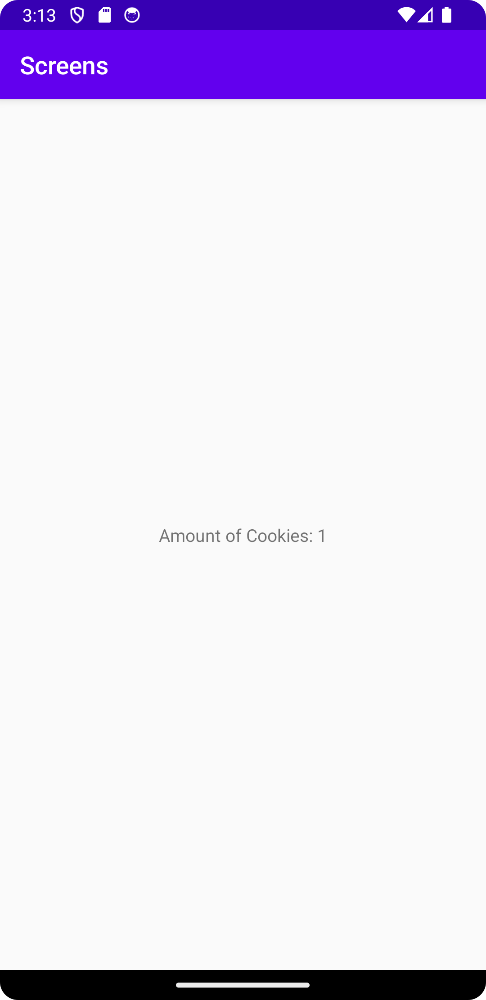

# Rapport

## Följande grundsyn gäller dugga-svar:

- Jag började med att lägga till en ny knapp i main activity och la den som den enda Viewen på activityn
- Jag la sedan till en empty Views activity och tog bort den överflödiga koden
- Jag la sedan till en intent på knappen så att den startar den nya aktiviteten när den trycks
```
...
        button = findViewById(R.id.button);
        button.setOnClickListener(new View.OnClickListener() {
            @Override
            public void onClick(View view) {

                amountOfCookies++;
                Intent intent = new Intent(MainActivity.this, CookieActivity.class);
                intent.putExtra("name", "Amount of Cookies: ");
                intent.putExtra("number", amountOfCookies);
                startActivity(intent);
            }
        });
...
```
- Jag la till en basic TextView till andra aktiviteten (cookieActivity)
- Jag la till funktionalitet för att anpassa vad som stod i textViewen beroende på vad som skickas med i bundlen
- Denna kod tillade jag i CookieActivity.java
```
    protected void onCreate(Bundle savedInstanceState) {
        super.onCreate(savedInstanceState);
        setContentView(R.layout.activity_cookie);
        
        Bundle extras = getIntent().getExtras();
        if (extras != null) {
            String name = extras.getString("name");
            int number = extras.getInt("number");
            TextView textView = findViewById(R.id.cookieText);
            textView.setText(name + number);
        }
    }
```
- Detta är vad som syns i mainActivity


- Detta är vad som syns när man tryckt på knappen
